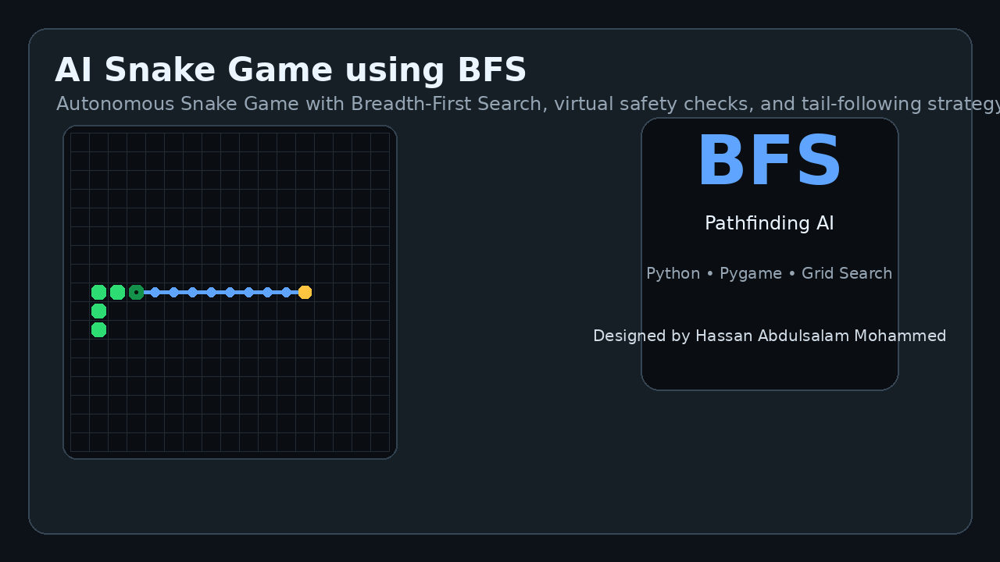
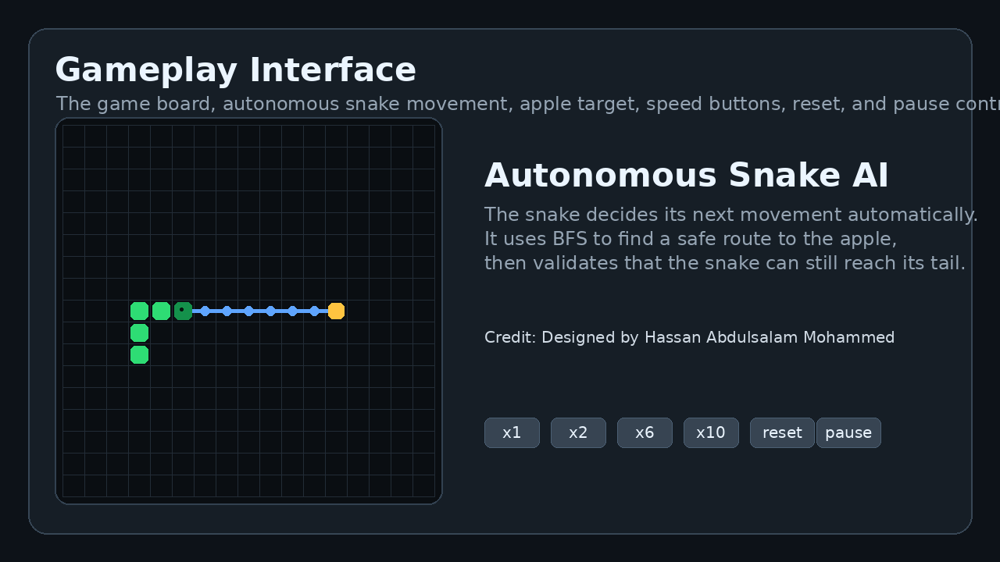
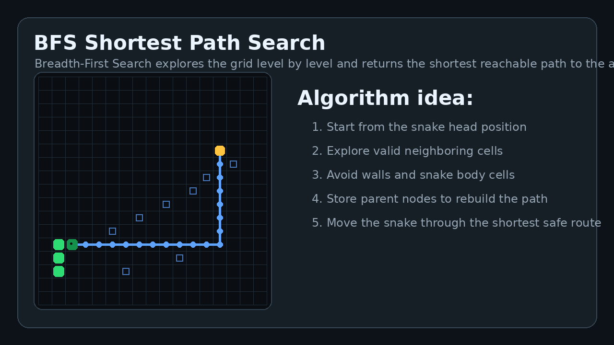
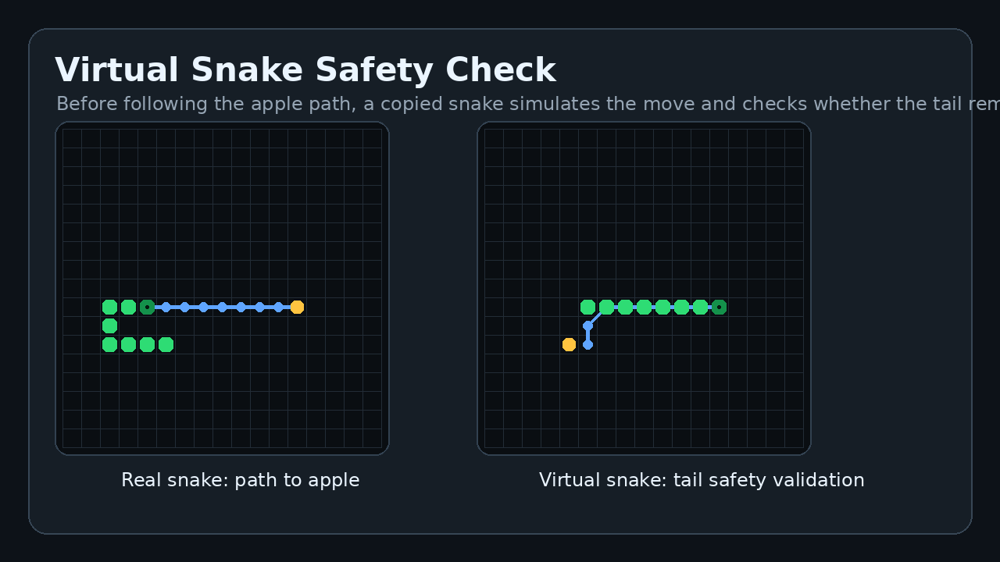
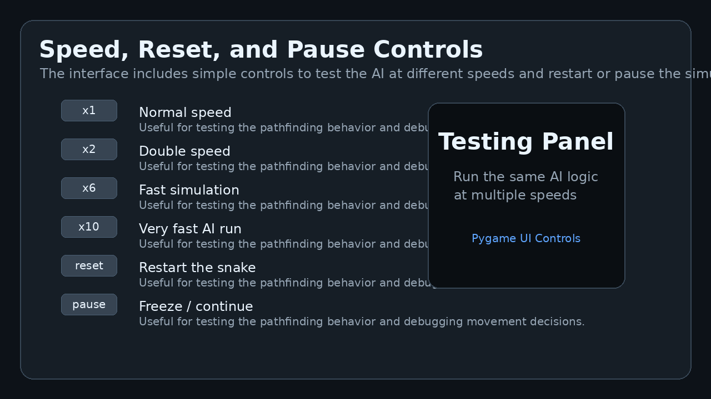
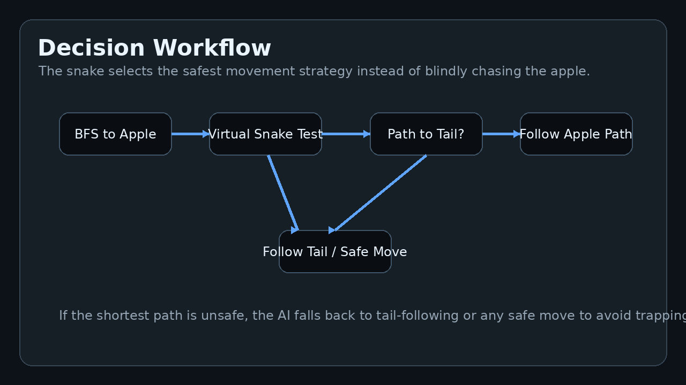
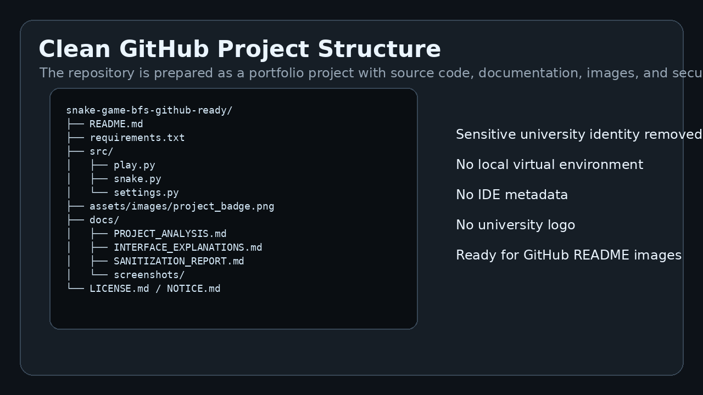

# AI Snake Game using BFS Pathfinding



A Python/Pygame implementation of an autonomous Snake Game where the snake uses **Breadth-First Search (BFS)** to find a safe path to the apple. The project demonstrates grid-based pathfinding, virtual-snake simulation, tail-following safety logic, and simple interactive controls for testing the algorithm.

> Portfolio version prepared by **Hassan Abdulsalam Mohammed**. University-specific identity and branding have been removed from this public GitHub version.

---

## Project Highlights

- Autonomous Snake movement using **BFS pathfinding**
- Shortest-path search from snake head to apple
- Virtual snake simulation before applying the real movement
- Safety check to confirm that the snake can still reach its tail after eating
- Fallback strategy using tail-following or any safe move when the apple path is risky
- Speed controls: `x1`, `x2`, `x6`, `x10`
- Reset and pause controls for testing
- Clean public repository structure with screenshots and documentation

---

## Screenshots

### Gameplay Interface


### BFS Pathfinding Visualization


### Virtual Snake Safety Check


### Control Panel Features


### Algorithm Workflow


### Clean Repository Structure


---

## How the AI Works

The snake does not move randomly. Each turn, it evaluates the board and chooses a safe path:

1. Use **BFS** to find the shortest path from the snake head to the apple.
2. Create a **virtual copy** of the snake.
3. Let the virtual snake follow the apple path.
4. After the virtual snake reaches the apple, check whether it can still reach its tail.
5. If the path is safe, the real snake follows it.
6. If the path is unsafe, the snake tries a tail-following or safe fallback move.

This makes the project stronger than a basic Snake game because it includes algorithmic decision-making and safety validation.

---

## Tech Stack

- Python
- Pygame
- Breadth-First Search algorithm
- Grid-based pathfinding
- Object-oriented programming

---

## Project Structure

```text
snake-game-bfs-github-ready/
├── README.md
├── requirements.txt
├── src/
│   ├── play.py
│   ├── snake.py
│   └── settings.py
├── assets/images/
│   └── project_badge.png
├── docs/
│   ├── PROJECT_ANALYSIS.md
│   ├── INTERFACE_EXPLANATIONS.md
│   ├── SANITIZATION_REPORT.md
│   └── screenshots/
├── LICENSE.md
└── NOTICE.md
```

---

## Installation

```bash
pip install -r requirements.txt
```

## Run the Game

```bash
python src/play.py
```

---

## Controls

| Button | Function |
|---|---|
| x1 | Normal speed |
| x2 | Double speed |
| x6 | Fast simulation |
| x10 | Very fast simulation |
| reset | Restart the game |
| pause | Pause or continue the game |

---

## Portfolio Note

This repository is prepared as a public portfolio version. Private/university identity files, local virtual environments, IDE files, cache files, and university-specific logos were removed.

---

## Attribution and License

This project is based on an MIT-licensed Snake Pathfinding AI implementation by **Hayder Kharrufa**. This public version was cleaned, documented, restructured, and branded for Hassan Abdulsalam Mohammed's portfolio. See `LICENSE.md` and `NOTICE.md` for details.
